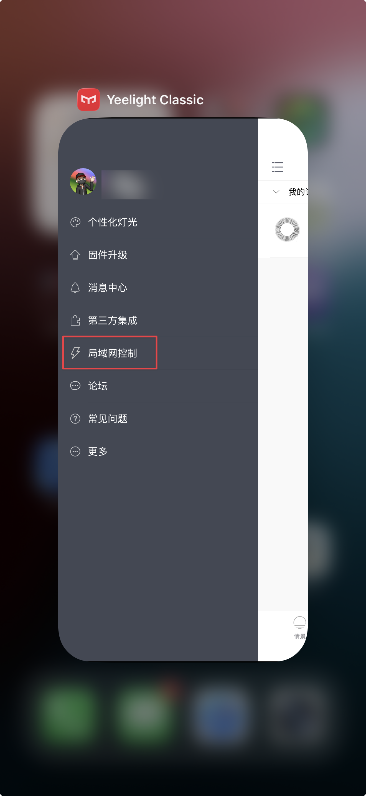
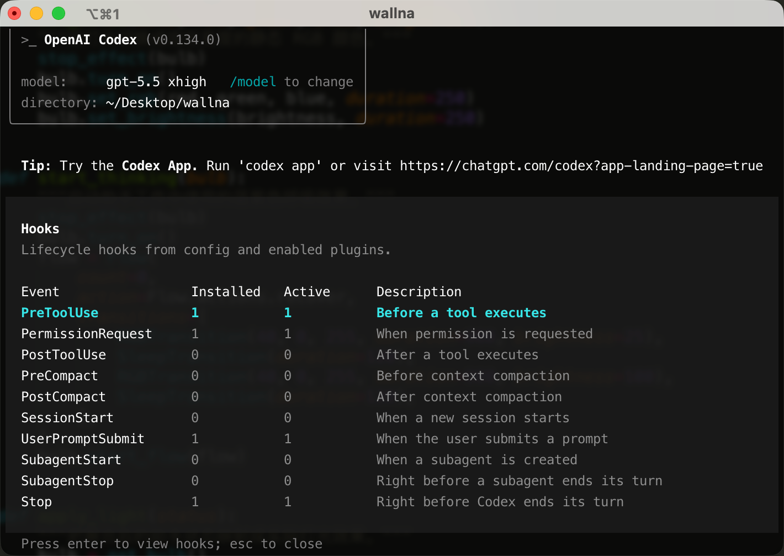

# Vibe Light

[中文说明](README.zh-CN.md)

<video src="images/x.mp4" controls=""></video>

**Vibe Light** uses hook events to drive a **Yeelight** light strip, turning the working status of an AI coding assistant into a desktop ambient light effect. It supports multi-task status aggregation, so the light state stays stable even when multiple tasks are running at the same time.

My **Yeelight** light strip was bought two years ago and has now been discontinued. Newer models are available, but before buying one, check with customer support to confirm that the device supports LAN control.

Yeelight light strips are available on Amazon, AliExpress, Temu, and other online marketplaces.

## Status Effects

| Assistant status | Trigger event | Light effect |
| --- | --- | --- |
| Thinking/running | `thinking`, `running` | Blue-purple breathing flow |
| Waiting for approval | `need_approval` | Solid magenta |
| Done/idle | `done` | Solid white |
| Manual reset | `reset`, `clear` | Clear state and return to idle |

## Files

- `hooks.json`: Hook configuration example that maps hook events to script commands.
- `vibe-light/yeelight_status.py`: Status aggregation and light control script.

## Prerequisites

1. Install Python 3.

2. Install the Yeelight Python package:

   ```bash
   pip3 install yeelight
   ```

3. Enable LAN control for the device in the **Yeelight App**. You can use **Yeelight Classic App** to enable LAN control, then find the device IP address in your router admin page.



## Change The IP

Edit `BULB_IP` in `vibe-light/yeelight_status.py` and set it to your own light strip IP.

```python
# Yeelight device address. Change this to your light strip or bulb IP.
BULB_IP = "192.168.3.57"
```

## Connect Hooks

Merge the `hooks` config from `hooks.json` into the configuration of an AI coding assistant that supports hooks, and make sure the script path in each command is valid:

```json
{
  "type": "command",
  "command": "python3 ~/.codex/vibe-light/yeelight_status.py thinking"
}
```

If the script is stored somewhere else, update the command path accordingly.

## Start Using

Put `hooks.json` in `~/.codex/`.

Put `vibe-light` in `~/.codex/`.

In Codex, enter `/hook` and follow the prompt to enable hook permissions.



## Manual Debugging

Trigger the running effect manually:

```bash
python3 vibe-light/yeelight_status.py running
```

Trigger the waiting-for-approval effect manually:

```bash
python3 vibe-light/yeelight_status.py need_approval
```

Switch to the done/idle state manually:

```bash
python3 vibe-light/yeelight_status.py done
```

Clear the state manually:

```bash
python3 vibe-light/yeelight_status.py clear
```

## Configuration

- `BULB_IP`: LAN IP address of the Yeelight light strip or bulb.
- `STATE_PATH`: State file path. Default: `/tmp/vibe-light-status.json`.
- `LOCK_PATH`: Lock file path. Default: `/tmp/vibe-light-status.lock`.

## Light Colors

Light effects are configured in the `apply_light()` function. To change colors, start by adjusting the RGB and brightness parameters. The last parameter is brightness.

### Static Light

```python
def apply_light(status):
    """Map the aggregated assistant status to the physical light effect."""
    bulb = get_bulb()
    if status == "running":
        start_thinking(bulb)
    elif status == "need_approval":
        set_solid(bulb, 255, 0, 217, 100)
    elif status == "done":
        set_solid(bulb, 255, 255, 255, 100)
```

### Breathing Light

`running` calls `start_thinking()`. Change this function to adjust the breathing flow.

The breathing light can also cycle through multiple colors, such as blue -> red -> green -> yellow -> purple -> white. In daily use, that can become distracting, so a single-color breathing effect is usually more comfortable.

```python
def start_thinking(bulb):
    """Start the blue-purple breathing effect used while the assistant works."""
    stop_effect(bulb)
    bulb.turn_on()
    flow = Flow(
        count=0,
        action=Flow.actions.recover,
        transitions=[
            RGBTransition(40, 0, 255, duration=900, brightness=25),
            SleepTransition(duration=120),
            RGBTransition(40, 0, 255, duration=900, brightness=100),
            SleepTransition(duration=120),
        ],
    )
    bulb.start_flow(flow)
```
